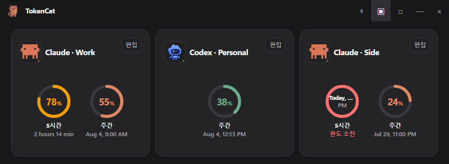
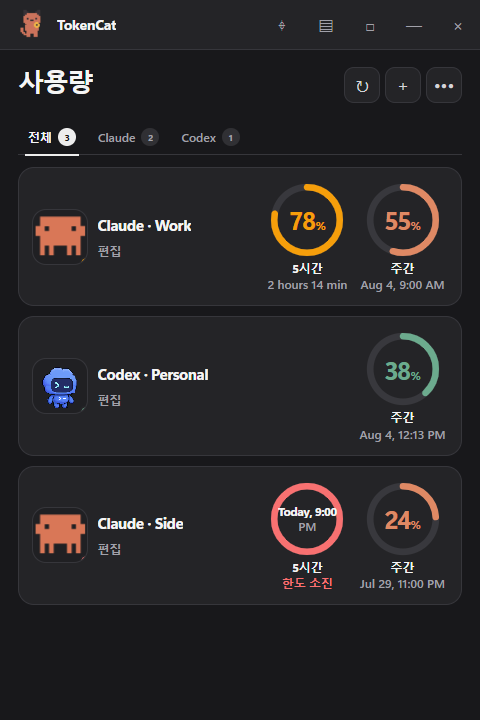
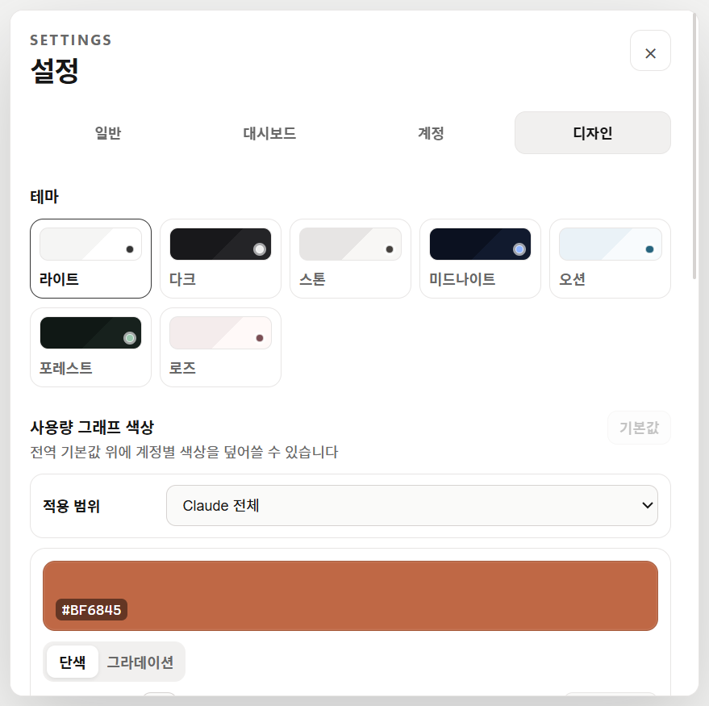

<p align="center">
  
</p>

<h1 align="center">TokenCat</h1>

<p align="center">
  <strong>Claude와 Codex 사용량을 한눈에 보는 Windows 데스크톱 위젯</strong>
</p>

<p align="center">
  여러 AI 계정의 5시간·주간 한도와 최신 컨텍스트 토큰을 확인하고,<br />
  창 크기에 맞춰 가로·세로·미니멀 위젯으로 자연스럽게 전환하세요.
</p>

<p align="center">
  <a href="https://github.com/jongcoding/TokenCat/releases/latest">
    
  </a>
  
  
  <a href="https://github.com/jongcoding/TokenCat/actions/workflows/release-windows.yml">
    
  </a>
</p>

<p align="center">
  <a href="https://github.com/jongcoding/TokenCat/releases/latest"><strong>Windows용 다운로드</strong></a>
  ·
  <a href="#주요-기능">주요 기능</a>
  ·
  <a href="#실제-계정-연동">계정 연동</a>
  ·
  <a href="#개발">개발</a>
</p>

---

## 한눈에 보기

<p align="center">
  
  <br />
  <sub>화면의 계정 이름과 사용량은 데모 데이터입니다.</sub>
</p>

<table>
  <tr>
    <td width="46%" align="center" valign="top">
      
      <br />
      <sub>세로형 위젯 · 원형 사용량 보기</sub>
    </td>
    <td width="54%" valign="top">
      <h3>작게 두어도 읽기 편하게</h3>
      <p>
        TokenCat은 창의 가로폭과 높이를 함께 보고 레이아웃을 바꿉니다.
        넓게 펼치면 여러 계정을 한 줄로, 세로로 줄이면 목록형으로,
        더 작게 만들면 필요한 수치만 남기는 미니멀 모드로 전환됩니다.
      </p>
      <ul>
        <li>가로 · 세로 · 2×2 · 3×3 계정 배치</li>
        <li>원형 링 · 막대 그래프 전환</li>
        <li>프로필, 플랜, 사용량 요소별 표시 설정</li>
        <li>항상 위, 자동 숨김, 창 크기 고정</li>
      </ul>
    </td>
  </tr>
</table>

## 주요 기능

| | |
| --- | --- |
| **실제 계정 연결**<br />Claude 공식 로그인과 Codex App Server를 통해 실제 사용 한도를 동기화합니다. | **여러 계정 관리**<br />Claude와 Codex 계정을 각각 분리된 로컬 프로필로 등록하고 한 화면에서 비교합니다. |
| **반응형 데스크톱 위젯**<br />창 크기에 따라 일반 화면과 가로·중간·세로 미니멀 모드가 자동으로 전환됩니다. | **사용량과 토큰 보기**<br />5시간·주간 한도뿐 아니라 Claude Code의 최신 컨텍스트 입력·출력 토큰도 표시합니다. |
| **내 취향대로 꾸미기**<br />계정별 색상, 그래프, 펫 움직임과 메인 위젯 불투명도를 60~100% 사이에서 조절합니다. 전체 위젯 또는 배경만 투명하게 만들 수 있습니다. | **로컬 사용 분석**<br />최근 사용 변화량을 기반으로 활동도와 예상 소진 속도를 확인합니다. 프롬프트 내용은 기록하지 않습니다. |
| **트레이 중심 조작**<br />작업표시줄 트레이에서 TokenCat 열기, 별도 설정 창, 항상 위, 업데이트 확인과 종료를 제어합니다. | **안전한 자동 업데이트**<br />설치형 버전은 GitHub Releases에서 새 버전을 확인하고 검증된 업데이트를 백그라운드로 받습니다. |

## 처음 시작하기

새 설치에는 샘플 계정이나 가짜 사용량이 들어 있지 않습니다. 첫 실행 시 별도의 3단계 시작 가이드가 열리며 Claude 또는 Codex를 선택하면 메인 창의 실제 계정 연결 화면으로 이어집니다. 가이드를 닫아도 빈 대시보드의 **시작 가이드** 또는 **설정 → 일반 → 시작 가이드**에서 언제든 다시 열 수 있습니다.

기존 버전에서 저장한 수동·실시간 계정과 화면 설정은 그대로 유지됩니다.

## 별도 설정 창

설정을 열어도 작은 위젯의 크기나 배치는 바뀌지 않습니다. 일반, 대시보드, 계정, 디자인과 자동 업데이트를 별도 창에서 관리합니다. 디자인에서 그래프·숫자·펫까지 함께 흐려지는 `전체 투명`과 콘텐츠는 선명하게 유지되는 `배경만 투명`을 선택할 수 있습니다. 투명도는 메인 위젯에만 적용되므로 설정 창은 항상 선명합니다.

> `배경만 투명`은 Windows 11 22H2 이상에서 사용할 수 있습니다. Windows 10에서는 위젯 전체에 적용되는 `전체 투명`을 사용할 수 있습니다.

<p align="center">
  
</p>

## 설치

### 권장: 설치형

1. [최신 GitHub Release](https://github.com/jongcoding/TokenCat/releases/latest)를 엽니다.
2. `TokenCat-Setup-<버전>-Windows.exe`를 내려받아 실행합니다.
3. 설치 후에는 TokenCat이 새 일반 릴리스를 주기적으로 확인하고 자동으로 다운로드합니다.
4. 다운로드가 끝나면 설정 창이나 트레이의 **업데이트를 위해 재시작**을 선택합니다.

> 현재 Windows Authenticode 코드 서명이 적용되지 않아 최초 다운로드나 설치 시 SmartScreen 경고가 표시될 수 있습니다. 파일은 릴리스의 SHA-512 메타데이터와 GitHub 자산 해시로 검증됩니다.

### Portable

`TokenCat-Portable-<버전>-Windows.exe`는 설치 없이 실행할 수 있지만 자동 업데이트는 지원하지 않습니다. 새 버전이 필요할 때 실행 파일을 직접 교체해야 합니다.

v0.26.0 이하의 기존 Portable 사용자는 설치형으로 자동 전환할 수 없습니다. v0.27.0 이상의 Setup 파일을 한 번 설치하면 이후 설치형 릴리스부터 자동 업데이트를 사용할 수 있습니다.

## 실제 계정 연동

> Claude 연동에는 [Claude Code](https://code.claude.com/docs/en/overview), Codex 연동에는 [Codex CLI](https://github.com/openai/codex)가 이 PC에 설치되어 있어야 합니다. TokenCat은 공식 CLI를 대신 설치하지 않습니다.

### Claude

- 계정별 `CLAUDE_CONFIG_DIR`에서 Claude 공식 로그인을 실행합니다.
- 공식 OAuth 사용량 응답에서 5시간·주간 사용률과 초기화 시각을 가져옵니다.
- Claude Code 로컬 transcript에서는 마지막 응답의 `usage` 숫자만 읽어 현재 컨텍스트 입력·캐시·출력 토큰을 계산합니다.
- 초기화 시각이 지난 오래된 한도는 숨기고, 다음 Claude Code 사용 뒤 최신 수치로 갱신합니다.

### Codex

- 계정별 `CODEX_HOME`에서 Codex App Server의 공식 ChatGPT 로그인을 사용합니다.
- 제공되는 실제 5시간·주간 한도와 초기화 시각을 동기화합니다.
- 여러 업무·개인 계정을 서로 분리된 프로필로 관리할 수 있습니다.

TokenCat은 이메일이나 비밀번호를 직접 받지 않으며 OAuth 자격 증명을 자체 연결·사용 기록에 복사해 저장하지 않습니다. 로그인 정보는 공식 CLI가 관리하고, TokenCat은 사용량 조회에 필요한 범위에서만 읽어 공식 서비스 주소로 요청합니다.

## 데이터와 개인정보

- 계정 별칭, 화면 배치와 디자인 설정은 이 PC의 TokenCat 사용자 데이터 폴더에 저장됩니다.
- 사용 분석에는 퍼센트 변화량과 선택 표시용 수치만 저장합니다.
- Claude transcript의 프롬프트·응답 본문을 TokenCat 데이터로 복사하거나 저장하지 않습니다.
- 관리형 계정을 제거하면 로컬 프로필은 복구 가능한 보관 위치로 이동합니다. 서비스의 원격 로그인 자체를 철회하는 동작은 아닙니다.

## 개발

### 요구 사항

- Windows 10/11 x64
- Node.js 22 이상
- npm

### 실행

```powershell
npm ci
npm run dev
```

### 검사

```powershell
npm test
npm run check:electron
npm run build
```

### Windows 패키지

```powershell
# 자동 업데이트를 지원하는 NSIS 설치 파일
npm run dist:win

# 설치하지 않고 실행하는 Portable 파일
npm run dist:portable
```

생성 파일은 Git에 포함되지 않는 `release/` 폴더에 저장됩니다.

## 릴리스

`.github/workflows/release-windows.yml`은 `vX.Y.Z` 태그가 푸시되면 다음 작업을 수행합니다.

1. 태그, `package.json`, `package-lock.json` 버전과 `main` 포함 여부 확인
2. 의존성 설치, Electron 구문 검사, 테스트와 renderer 빌드
3. NSIS Setup, blockmap, Portable, `latest.yml`을 draft 릴리스에 업로드
4. 로컬·GitHub 자산의 이름, 크기, SHA-256과 `latest.yml`의 SHA-512 검증
5. 모든 검증이 통과한 경우에만 최신 일반 릴리스로 공개

```powershell
git tag -a v0.30.0 -m "TokenCat v0.30.0"
git push origin main
git push origin v0.30.0
```

공개한 태그나 같은 버전의 파일을 덮어쓰지 않습니다. 수정이 필요하면 더 높은 patch 버전으로 새 릴리스를 만듭니다.

## 라이선스

현재 별도 오픈소스 라이선스가 부여되지 않았습니다. 소스 코드는 공개되어 있지만 모든 권리는 저작권자에게 있습니다.

버그 제보와 기능 제안은 [GitHub Issues](https://github.com/jongcoding/TokenCat/issues)에서 받습니다.

Claude와 Anthropic은 Anthropic PBC의 상표이며, Codex와 OpenAI는 OpenAI의 상표입니다. TokenCat은 해당 회사의 공식 제품이 아닙니다.
